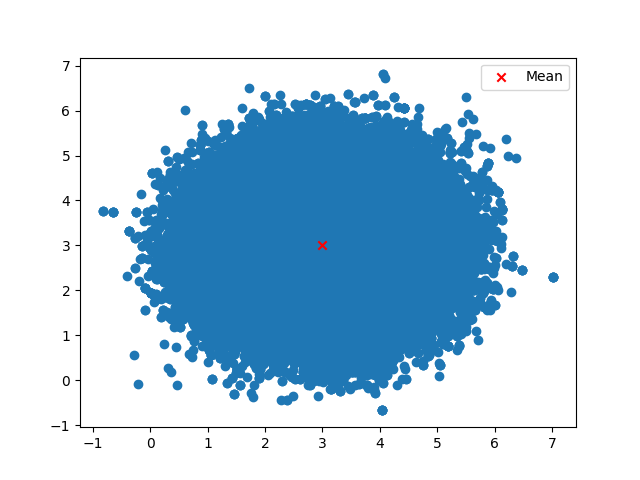

# JAX HMC

A simple implementation of Hamiltonian Monte Carlo (HMC) using JAX.

```sh
uv init
source .venv/bin/activate
uv sync
```

# Example

```py
import jax
import jax.numpy as jnp

from jaxhmc.mcmc import HMCConfig, hmc
from jaxhmc.potentials import GaussianPotential

# We first sample an initial position
key = jax.random.key(42)
key, subkey = jax.random.split(key, 2)
initial_position = jax.random.uniform(subkey, (16, 2))


mu = jnp.ones(initial_position.shape[1]) + 2
potential = GaussianPotential(mu=mu)
config = HMCConfig(
    initial_step_size=0.1,
    max_path_len=2,
    warmup_steps=100,
    iterations=20000,
    initial_precm=jnp.eye(potential.dim),
    key=key,
)

hmc_jit = jax.jit(hmc)

momenta, samples = hmc_jit(
    potential=potential,
    initial_position=initial_position,
    config=config,
)

samples = samples.reshape(-1, 2) # (num_chains * num_samples, dim)

```

